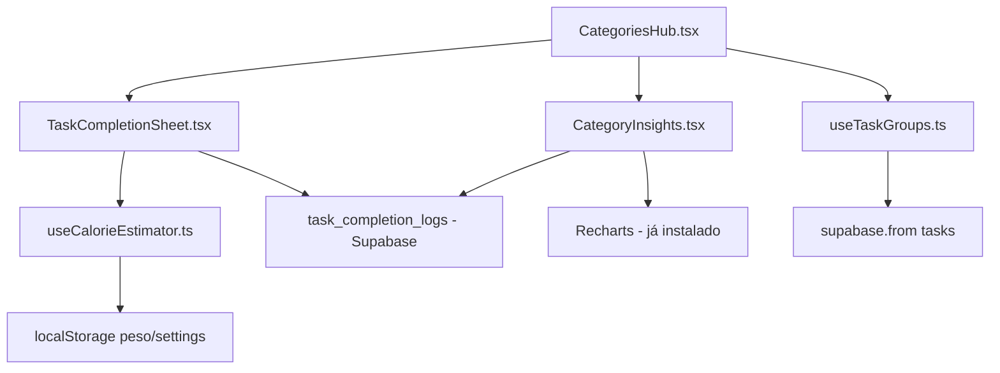

# 🎨 Design — Spec 006: Smart Hub Views + Completion Intelligence

## Divisão UI (Stitch vs Antigravity)

| Componente                                    | Responsável     | Motivo                                                               |
| --------------------------------------------- | --------------- | -------------------------------------------------------------------- |
| `TaskCompletionSheet.tsx`                     | **Antigravity** | Lógica condicional pesada (tipo de task → campos diferentes)         |
| `CategoryInsights.tsx`                        | **Antigravity** | Recharts + dados computados do hook; extensão da Analytics existente |
| Refatoração do `CategoriesHub.tsx`            | **Antigravity** | Integrar agrupamento temporal/contextual inline                      |
| `useTaskGroups.ts` + `useCalorieEstimator.ts` | **Antigravity** | Hooks puros de lógica                                                |

> Nenhum componente ultrapassa 200 linhas de JSX novo isolado, então Stitch MCP **não é necessário** nesta spec.

---

## Modelagem do Banco (Supabase)

### Nova Tabela: `task_completion_logs`

```sql
CREATE TABLE IF NOT EXISTS public.task_completion_logs (
  id UUID DEFAULT gen_random_uuid() PRIMARY KEY,
  task_id UUID NOT NULL,
  user_id UUID REFERENCES auth.users(id) ON DELETE CASCADE NOT NULL,

  -- Campos universais
  completed_at TIMESTAMPTZ DEFAULT NOW(),
  notes TEXT,

  -- Campos de Treino
  actual_duration_minutes INT,
  perceived_intensity INT CHECK (perceived_intensity BETWEEN 1 AND 5),
  estimated_calories NUMERIC(6,1),

  -- Metadata
  category TEXT,
  log_type TEXT DEFAULT 'general' CHECK (log_type IN ('general', 'study', 'workout', 'work'))
);

ALTER TABLE public.task_completion_logs ENABLE ROW LEVEL SECURITY;
CREATE POLICY "Users own logs" ON public.task_completion_logs
  FOR ALL USING (auth.uid() = user_id);
```

### Lógica de Calorias (MET)

A fórmula padrão de gasto calórico é:

```
Calorias = MET × Peso(kg) × Duração(horas)
```

Valores de MET por tipo de treino:
| Tipo | MET |
|---|---|
| Musculação (general) | 6.0 |
| Cardio (corrida) | 8.0 |
| Cardio (caminhada) | 3.5 |
| Crossfit/HIIT | 8.0 |
| Flexibilidade/Yoga | 2.5 |

O **peso** será recuperado do `localStorage` (salvo no WorkoutOnboarding) ou do `settings` da categoria no DB.

---

## Mapa de Dependências



---

## UX Flow

### 1. Hub de Categoria (Treino)

```
Tab "Treino" →
  [Header Card: Meu Hub de Treino]

  📅 HOJE (Qua, 05 Mar)
    └─ Treino A (Peito/Tríceps) · 18:00 · 60m

  📅 AMANHÃ (Qui, 06 Mar)
    └─ Treino B (Costas/Bíceps) · 18:00 · 60m

  📅 ESTA SEMANA
    └─ Treino C (Pernas/Ombro) · Sex 18:00 · 60m
    └─ Treino A (Peito/Tríceps) · Sáb 18:00 · 60m

  [🔍 Ver Insights do Treino] ← botão
```

### 2. Completion Sheet (Treino)

```
Ao clicar ✓ no "Treino A":
  ┌─ Sheet (bottom) ──────────────┐
  │ ✅ Treino A Concluído!        │
  │                                │
  │ ⏱ Duração real: [__60__] min   │
  │ 💪 Intensidade: ⭐⭐⭐⭐☆       │
  │ 🔥 Calorias estimadas: ~360   │
  │                                │
  │ 📝 Notas (opcional):          │
  │ [________________________]     │
  │                                │
  │ [Salvar e Concluir]           │
  └────────────────────────────────┘
```

### 3. Completion Sheet (Estudo)

```
Ao clicar ✓ na "Aula: Programação":
  ┌─ Sheet (bottom) ──────────────┐
  │ ✅ Aula Concluída!            │
  │                                │
  │ 📝 Notas da Aula:             │
  │ [________________________]     │
  │ [________________________]     │
  │ [________________________]     │
  │                                │
  │ [Salvar Notas e Concluir]     │
  └────────────────────────────────┘
```

### 4. Category Insights (Treino)

```
  ┌─ Tela Insights: Treino ───────┐
  │ 🏋️ Resumo do Meu Treino       │
  │                                │
  │ [12] treinos · [8] concluídos │
  │ [4,320] calorias estimadas    │
  │ Intensidade média: 3.8/5      │
  │                                │
  │ 📊 Evolução Semanal           │
  │ [BarChart: calorias/semana]   │
  │                                │
  │ 📊 Por Grupo Muscular         │
  │ [PieChart: A/B/C distribution]│
  │                                │
  │ 💡 "Seu volume de pernas está │
  │  abaixo da média. Equilibre." │
  └────────────────────────────────┘
```
